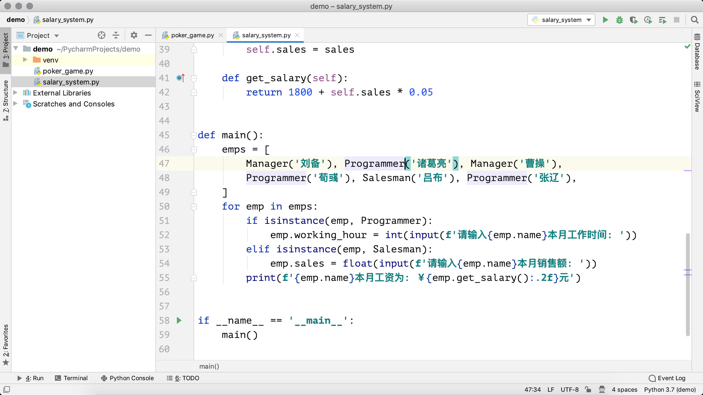
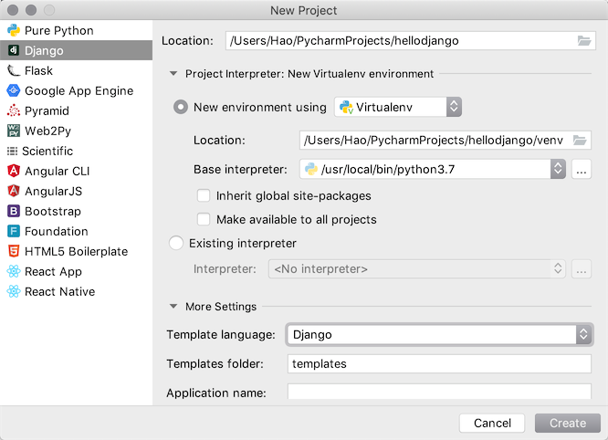
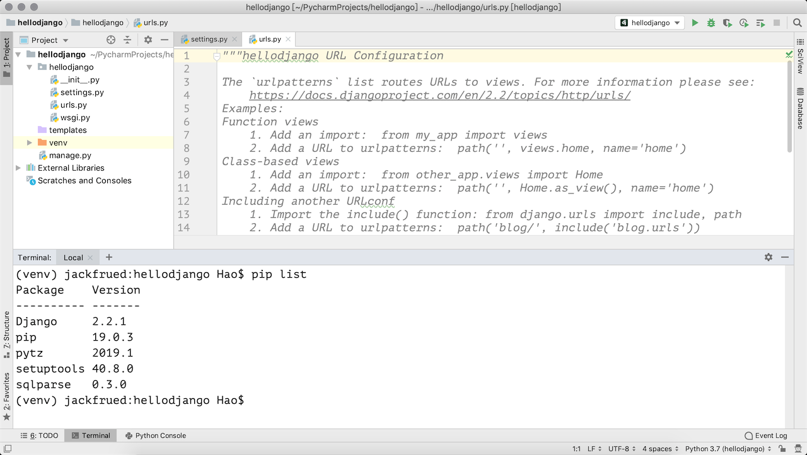
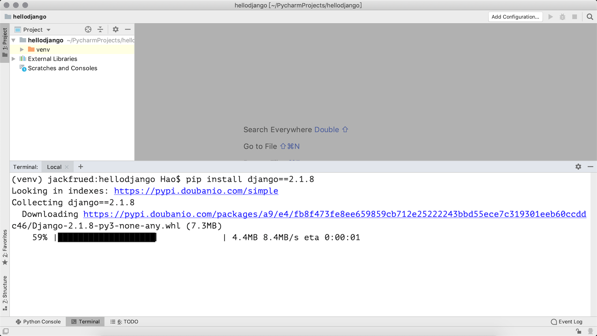

## 玩转PyCharm

PyCharm是由JetBrains公司开发的提供给Python专业的开发者的一个集成开发环境，它最大的优点是能够大大提升Python开发者的工作效率，为开发者集成了很多用起来非常顺手的功能，包括代码调试、高亮语法、代码跳转、智能提示、自动补全、单元测试、版本控制等等。此外，PyCharm还提供了对一些高级功能的支持，包括支持基于Django框架的Web开发。

### PyCharm的安装

可以在[JetBrains公司的官方网站]()找到PyCharm的[下载链接](https://www.jetbrains.com/pycharm/download/)，有两个可供下载的版本一个是社区版一个是专业版，社区版在[Apache许可证](https://zh.wikipedia.org/wiki/Apache%E8%AE%B8%E5%8F%AF%E8%AF%81)下发布，专业版在专用许可证下发布（需要购买授权下载后可试用30天），其拥有许多额外功能。安装PyCharm需要有JRE（Java运行时环境）的支持，如果没有可以在安装过程中选择在线下载安装。

> 说明：如果你是一名学生，希望购买PyCharm来使用，可以看看[教育优惠官方申请指南](https://sales.jetbrains.com/hc/zh-cn/articles/207154369)。

### 首次使用的设置

第一次使用PyCharm时，会有一个导入设置的向导，如果之前没有使用PyCharm或者没有保存过设置的就直接选择“Do not import settings”进入下一步即可。

专业版的PyCharm是需要激活的，**强烈建议为优秀的软件支付费用**，如果不用做商业用途，我们可以暂时选择试用30天或者使用社区版的PyCharm。

 接下来是选择UI主题，这个可以根据个人喜好进行选择。

 再接下来是创建可以在终端（命令行）中使用PyCharm项目的启动脚本，当然也可以直接跳过这一步。

然后可以选择需要安装哪些插件，我们可以暂时什么都不安装等需要的时候再来决定。

### 用PyCharm创建项目

点击上图中的“Start using PyCharm”按钮就可以开始使用PyCharm啦，首先来到的是一个欢迎页，在欢迎页上我们可以选择“创建新项目”、“打开已有项目”和“从版本控制系统中检出项目”。

如果选择了“Create New Project”来创建新项目就会打一个创建项目的向导页。

在如上图所示的界面中，我们可以选择创建项目的模板，包括了纯Python项目、基于各种不同框架的Web项目、Web前端项目、跨平台项目等各种不同的项目模板。如果选择Python的项目，那么有一个非常重要的设定是选择“New environment…”（创建新的虚拟环境）还是使用“Existing Interpreter”（已经存在的解释器）。前者肯定是更好的选择，因为新的虚拟环境不会对系统环境变量中配置的Python环境造成影响，简单举个例子就是你在虚拟环境下安装或者更新了任何三方库，它并不会对系统原有的Python解释器造成任何的影响，但代价是需要额外的存储空间来建立这个虚拟环境。

项目创建完成后就可以开始新建各种文件来书写Python代码了。

在工作窗口的右键菜单中可以找到“Run ...”和“Debug ...”菜单项，通过这两个菜单项我们就可以运行和调试我们的代码啦。建议关注一下菜单栏中的“Code”、“Refactor”和“Tools”菜单，这里面为编写Python代码提供了很多有用的帮助。

### 用PyCharm创建项目

启动PyCharm之后会来到一个欢迎页，在欢迎页上我们可以选择“创建新项目”（Create New Project）、“打开已有项目”（Open）和“从版本控制系统中检出项目”（Get from Version Control）。

/Python-100-Days-master(作者原生未修改版)/res/pycharm-welcome.png)

如果选择了“Create New Project”来创建新项目就会打一个创建项目的向导页。下图所示是PyCharm专业版创建新项目的向导页，可以看出专业版支持的项目类型非常的多，而社区版只能创建纯Python项目（Pure Python），没有这一系列的选项。

/Python-100-Days-master(作者原生未修改版)/res/pycharm-project-wizard.png)

接下来，我们要为项目创建专属的虚拟环境，每个Python项目最好都在自己专属的虚拟环境中运行，因为每个项目对Python解释器和三方库的需求并不相同，虚拟环境对不同的项目进行了隔离。在上图所示的界面在，我们可以选择新建虚拟环境（New environment using Virtualenv），这里的“Virtualenv”是PyCharm默认选择的创建虚拟环境的工具，我们就保留这个默认的选项就可以了。

项目创建完成后就可以开始新建各种文件来书写Python代码了，如下图所示。左侧是项目浏览器，可以看到刚才创建的项目文件夹以及虚拟环境文件夹。我们可以在项目上点击鼠标右键，选择“New”，在选择“Python File”来创建Python代码文件，下图中我们创建了两个Python文件，分别是`poker_game.py`和`salary_system.py`。当然，如果愿意，也可以使用复制粘贴的方式把其他地方的Python代码文件复制到项目文件夹下。

/Python-100-Days-master(作者原生未修改版)/res/pycharm-workspace.png)

在工作窗口点击鼠标右键可以在上下文菜单中找到“Run”选项，例如要运行`salary_system.py`文件，右键菜单会显示“Run 'salary_system'”选项，点击这个选项我们就可以运行Python代码啦，运行结果在屏幕下方的窗口可以看到，如下图所示。

/Python-100-Days-master(作者原生未修改版)/res/pycharm-run-result.png)

### 常用操作和快捷键

PyCharm为写Python代码提供了自动补全和高亮语法功能，这也是PyCharm作为集成开发环境（IDE）的基本功能。PyCharm的“File”菜单有一个“Settings”菜单项（macOS上是在“PyCharm”菜单的“Preferences…”菜单项），这个菜单项会打开设置窗口，可以在此处对PyCharm进行设置，如下图所示。

PyCharm的菜单项中有一个非常有用的“Code”菜单，菜单中提供了自动生成代码、自动补全代码、格式化代码、移动代码等选项，这些功能对开发者来说是非常有用的，大家可以尝试使用这些菜单项或者记住它们对应的快捷键，例如在macOS上，格式化代码这个菜单项对应的快捷键是`alt+command+L`。除此之外，“Refactor”菜单也非常有用，它提供了一些重构代码的选项。所谓重构是在不改变代码执行结果的前提下调整代码的结构，这也是资深程序员的一项重要技能。还有一个值得一提的菜单是“VCS”，VCS是“Version Control System”（版本控制系统）的缩写，这个菜单提供了对代码版本管理的支持。版本控制的知识会在其他的课程中为大家讲解。

下表列出了一些PyCharm中特别常用的快捷键，当然如果愿意，也可以通过设置窗口中“Keymap”菜单项自定义快捷键，PyCharm本身也针对不同的操作系统和使用习惯对快捷键进行了分组。

| 快捷键                                        | 作用                                   |
| --------------------------------------------- | -------------------------------------- |
| `command + j`                                 | 显示可用的代码模板                     |
| `command + b`                                 | 查看函数、类、方法的定义               |
| `ctrl + space`                                | 万能代码提示快捷键，一下不行按两下     |
| `command + alt + l`                           | 格式化代码                             |
| `alt + enter`                                 | 万能代码修复快捷键                     |
| `ctrl + /`                                    | 注释/反注释代码                        |
| `shift + shift`                               | 万能搜索快捷键                         |
| `command + d` / `command + y`                 | 复制/删除一行代码                      |
| `command + shift + -` / `command + shift + +` | 折叠/展开所有代码                      |
| `F2`                                          | 快速定位到错误代码                     |
| `command+ alt + F7`                           | 查看哪些地方用到了指定的函数、类、方法 |

> **说明**：Windows系统下如果使用PyCharm的默认设置，可以将上面的`command`键换成`ctrl`键即可，唯一的例外是`ctrl + space`那个快捷键，因为它跟Windows系统切换输入法的快捷键是冲突的，所以在Windows系统下默认没有与之对应的快捷键。

### 创建Django项目

#### 专业版

PyCharm专业版提供了对Django、Flask、Google App Engine、web2py等Python Web框架以及SQL、UML、前端语言和框架、远程调试、虚拟化部署等功能的支持，如果使用PyCharm专业版，在创建项目时可以直接选择创建Django项目并设置模板语言以及放置模板页的文件夹。

创建好项目之后，打开终端输入`pip list`命令，可以看到项目所需的依赖项已经安装好了，而且可以直接点击屏幕右上方的运行或调试按钮来直接运行Django项目。

#### 社区版

PyCharm社区版只能创建Python项目，如果项目中需要Django的支持，可以自行安装依赖库并创建Django项目。

创建好Python项目之后，可以打开屏幕下方的终端（Terminal），并通过`pip install`安装Django项目的依赖项，可以通过`-i https://pypi.doubanio.com/simple`来指定下载依赖库的镜像仓库。

当然也可以在项目的设置菜单中找到解释器配置，并选择要添加的依赖项。

下面是搜索依赖项的界面，可以通过点击“Install Package”按钮来安装指定的依赖项；也可以通过点击“Manage Repositories”按钮来指定下载依赖项的仓库，国内用户推荐使用豆瓣镜像<http://pypi.doubanio.com/simple>。

接下来可以在终端中输入`django-amdin startproject`指令来创建项目。

如果要运行项目，可以在终端中输入`python manage.py runserver`启动测试服务器。当然，也可以点击屏幕右上方的“Add Configuration”按钮，进入如下所示的配置界面，并点击窗口左上角的“+”来添加一个运行配置。

在配置窗口的右侧，指定要执行的脚本路径（Django项目的manage.py文件的位置）和运行参数（runserver），运行参数的后面还可以跟IP地址和端口。

注意到窗口的右上角了吗？现在可以点击运行或调试按钮来启动测试服务器运行项目了。

pycharn快捷键

.jpg)

.jpg)

## 一、Pycharm常用快捷键

| 快捷键                   | 作用                                | 备注                             |
| ------------------------ | ----------------------------------- | -------------------------------- |
| ctrl + win + 空格        | 自动提示并导包                      | 连按两次                         |
| ctrl + alt + 空格        | 自动提示并导包                      | 连按两次                         |
| Alt + Enter              | 快速导包                            | -                                |
| Ctrl + Y                 | 删除                                | -                                |
| Ctrl + D                 | 复制一行                            | -                                |
| Ctrl + Alt + L           | 格式化代码                          | 需要取消ubuntu的默认的注销快捷键 |
| ctrl + o                 | 重写方法                            | 可以输入方法名过滤出方法         |
| ctrl + p                 | 查看方法参数                        | -                                |
| Ctrl + H                 | 快速查看类继承结构                  | 光标需要定位在类的内部           |
| Alt + F7                 | 查看 变量/方法/资源id在哪里被使用了 | -                                |
| Ctrl + N                 | 查找py文件                          | -                                |
| Ctrl + Shift + N         | 查找任意文件                        | -                                |
| shift                    | 查找任意文件                        | 连按两次                         |
| Ctrl + E                 | 最近编辑的文件列表                  | -                                |
| Shift + F6               | 重命名                              | -                                |
| F2                       | 光标定位到报错的地方                | -                                |
| Ctrl + F                 | 当前文件内搜索                      | -                                |
| Ctrl + Shift + F         | 全局搜索                            | -                                |
| Ctrl + R                 | 当前文件内替换                      | -                                |
| Ctrl + Shift + R         | 全局替换                            | -                                |
| Ctrl + Shift + Backspace | 回到上一次编辑的位置                | -                                |
| F5                       | 复制文件                            | -                                |
| Ctrl + W                 | 快速选中字符串                      | -                                |
| Ctrl +Shift + F12        | 最大化窗口                          | -                                |
| Alt + Shift + U          | 大写/小写切换                       | -                                |
| Alt + Shift + up/down    | 代码上下移动                        | -                                |
| Ctrl + Alt + O           | 清除没有用到的包                    | -                                |
| Shift + enter            | 光标定位到下一行                    | -                                |
| Ctrl + Shift + -         | 折叠代码                            | -                                |
| Ctrl + Shift + +         | 展开代码                            | -                                |